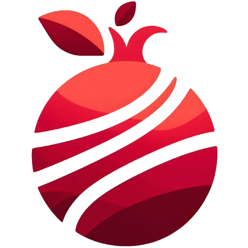

  
  <h1 display="inline" align="center"><strong>Rhode</strong></h1>

Rhode is a knowledge-building tool for mathematicians; that is, it helps you collect the mathematical knowledge you come across (the definitions, corollories, examples etc.) into an organized structure that you can draw insights from.

It's intuitive to pick up and convenient to use, whether you're just starting out your journey into mathematics or have years of research under your belt.

> [!WARNING]
> This project is still in development.

## Installation
Rhode is currently only distributed on Windows.
To install, download and run the installer from the [latest release page](https://github.com/NitzanHen/rhode-releases/releases/latest).

> [!IMPORTANT]
> The Rhode installer and app are not code signed yet - this means that Windows pops a scary warning when attempting to install or run it for the first time.  
> Just to be clear: *Rhode is completely safe*. It manages only its own data.

Rhode features automatic updates, so in principle it only needs to be downloaded once.

## How does it work?
Consider a math textbook. Typically, each chapter or article is written as a body of prose text, with the important bits – definitions, propositions and theorems, corollaries and so on – emphasized within the text.

The important bits, which we'll call *references*, are the heart of the textbook. These are the most interesting parts that further results – in the same textbook, in a different textbook or paper or even in open research – will rely on.  
These references are *embedded* in a broader discussion of the material at hand that provides context, motivation, informal insights and further clarifications. This additional information plays a minor role in writing correct proofs (compared to the references, at least), but its role in teaching an unfamiliar reader is no less important than that of the "dry" references.

In rough terms, we can say that the references are the formal parts that might be *referred* to when writing proofs that build on the material (hence the name), while the complete discussion is important for *studying* the material and getting familiar with it.

This is the essence of Rhode's approach to building up knowledge. It's comprised of two systems:
1. **The reference system**: a `Reference` is an atomic piece of formal ("dry") math - an axiom, definition, proposition, corollary, etc. Its statement and proof (if applicable) can refer to other references, i.e. rely on them logically, and other references can refer to it. These pieces form a web of logical results and implications, the natural structure for which is a (directed) graph.
2. **The document system**: a `Document` is a sequence of blocks, each of which can be a prose block or an *embedded reference* block. Documents are used to combine a collection of references into a complete discussion.

When studying or reviewing material, you'll mostly work with documents and manage references through them. For more specific use cases, you'll query or work with references directly.

## How is Rhode useful?
As a knowledge-building tool, Rhode's features are roughly grouped into two: 

### Collecting & Organizing knowledge
As a math student or researcher, you likely have some experience with taking notes in a lecture, while studying from a textbook or when preparing to an exam. Naturally, material is often organized linearily, with a definition or proposition appearing before anything that uses them.   
In reality, however, the process of internalizing new information is only semi linear - while following the linear lecture or notes we jump around quite a lot, to review things we've forgotten or unsure about, correct or refine something we've already written or understand how similar questions were solved in class.  
Rhode embraces this semi-linearity, and is built around making the most out of it: 

- **Refernces** are very flexible and non-linear by nature: each reference is an atomic piece, and these atomic pieces can be linked to one another, unbothered by time or date of creation.  
- On the other hand, **documents** are linear by nature: they group atomic references in order, and provide context or motivation. 

Thus, working on a document allows you to study in a natural order, and jumping to the references it relies on allows changing and adding to previous knowledge easily.

Furthermore, there's nothing stopping you from creating multiple references for similar or equivalent definitions and statements, or multiple documents for similar discussions; that way, you can easily experiment with different approaches and proofs and refactor over time.

### Drawing insights & Exporting resources
TODO

## About this repository
This repo *does not* contains Rhode's source code; it's used to host Rhode's releases and provide documentation (such as the file you're reading right now).
At present, Rhode is not open-source.
